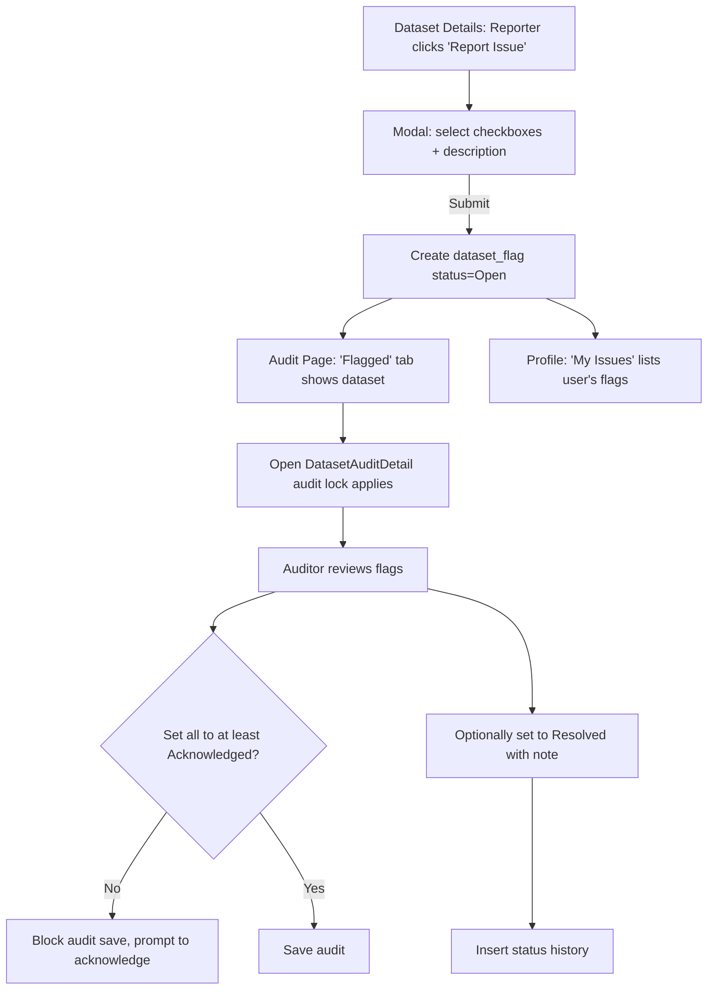

## Dataset Flagging Feature — Implementation Plan

### Goals (MVP for demo)

- Allow authenticated users to report issues on a dataset from the `DatasetDetails` page.
- Issue fields: two checkboxes (Auto mosaic issue, Prediction issue) and a required free-text description.
- Status lifecycle: Open → Acknowledged → Resolved.
- Visibility: Only reporter and auditors (core team) can view flags. Dataset owners cannot.
- New “Flagged” tab in audit page showing datasets with Open/Acknowledged flags. From there, auditors can open `DatasetAuditDetail` with normal audit lock rules.
- Inside `DatasetAuditDetail`, list all flags for the dataset; auditor can acknowledge/resolve and add a resolution note. Audit save requires all flags to be at least Acknowledged.
- Profile page: add “My Issues” tab listing the user’s flags with status and links; show total count in header; users cannot edit or delete after filing.
- Minimal audit trail: separate status history table logging transitions with timestamp and actor. Cascade delete with dataset.

---

### Database (Supabase / Postgres)

Tables

- `dataset_flags`

  - id (bigserial PK)
  - dataset_id (bigint, FK → `v2_datasets.id` ON DELETE CASCADE)
  - created_by (uuid, FK → auth.users.id)
  - is_ortho_mosaic_issue (boolean, not null)
  - is_prediction_issue (boolean, not null)
  - description (text, not null)
  - status (text enum: 'open' | 'acknowledged' | 'resolved', default 'open')
  - auditor_comment (text, nullable)
  - resolved_by (uuid, nullable, FK → auth.users.id)
  - created_at (timestamptz, default now())
  - updated_at (timestamptz, default now())
  - indexes: (dataset_id), (created_by), (status, dataset_id)

- `dataset_flag_status_history`
  - id (bigserial PK)
  - flag_id (bigint, FK → `dataset_flags.id` ON DELETE CASCADE)
  - old_status (text)
  - new_status (text)
  - changed_by (uuid, FK → auth.users.id)
  - note (text, nullable)
  - changed_at (timestamptz, default now())
  - index: (flag_id), (changed_at DESC)

RLS Policies

- `dataset_flags`:
  - SELECT: reporter (created_by = auth.uid()) OR auditor (in `privileged_users`) can read.
  - INSERT: only authenticated; created_by = auth.uid().
  - UPDATE: only auditors can change `status`, `auditor_comment`, `resolved_by`; no one else may update (reporters cannot edit).
  - DELETE: only auditors if needed; for MVP we can disallow DELETE entirely.
- `dataset_flag_status_history`:
  - SELECT: same visibility as parent flag (join on flag_id).
  - INSERT: only service role or RPC used by auditors when status changes.

Notes

- No geometry/attachments in MVP (explicitly out of scope).
- No new columns added to `v2_statuses` per requirement; use a view for counts.

---

### Frontend Changes (React + TypeScript)

New Types

- `src/types/flags.ts`
  - `FlagStatus = 'open' | 'acknowledged' | 'resolved'`
  - `DatasetFlag { id, dataset_id, created_by, is_ortho_mosaic_issue, is_prediction_issue, description, status, auditor_comment?, resolved_by?, created_at, updated_at }`
  - `DatasetFlagHistory { id, flag_id, old_status, new_status, changed_by, note?, changed_at }`

New Hooks (React Query + Supabase)

- `useDatasetFlags(datasetId: number)` — fetch flags for a dataset (reporter sees own; auditor sees all per RLS).
- `useCreateFlag()` — insert new flag.
- `useUpdateFlagStatus()` — auditor-only mutation to set status + optional auditor_comment + resolved_by; also inserts into `dataset_flag_status_history` in a transaction (via RPC or sequential calls).
- `useMyFlags()` — list flags created by current user.
- `useFlaggedDatasets()` — returns aggregated datasets that have Open/Acknowledged flags (leverages counts view or client aggregation).

Dataset Details UI

- Add “Report Issue” button (top-right of left column near AuditBadge) → opens modal.
- Modal inputs:
  - Checkboxes: Auto mosaic issue, Prediction issue (at least one required)
  - Description (required, multiline)
  - Submit creates flag and closes modal; toast success.
- If the viewer is the reporter and they have existing flags, show a small inline banner: “You reported X issue(s): [Open/Acknowledged/Resolved]” with link to view.

Audit Page (`src/pages/DatasetAudit.tsx`)

- Add filter segment "Flagged" between existing segments, showing count of datasets with Open/Acknowledged flags.
- In flagged view, list datasets (one row per dataset), with columns including: ID, filename, flag count, latest status (e.g., if any Open → show Open, else Acknowledged), and an action to "Open Audit" which navigates to `DatasetAuditDetail` and respects audit lock.

Dataset Audit Detail (`src/components/DatasetAudit/DatasetAuditDetail.tsx`)

- New collapsible panel “User-reported issues” listing flags (Open/Acknowledged/Resolved) with description and chips.
- For auditors: controls to set each flag to Acknowledged/Resolved + optional resolution note.
- On audit save: validate all flags are at least Acknowledged; if not, block with message.

Profile Page (`src/pages/Profile.tsx`)

- Add "My Issues" tab next to existing tabs.
- Header shows total count of flags created by the user.
- Table lists: dataset_id (link to details), created_at, categories, status, last update; no edit/delete actions.

Routing/Navigation

- Clicking a dataset in Flagged tab opens `DatasetAuditDetail` directly (same lock rules via `useSetAuditLock`).

---

### Validation & UX Rules

- Report modal: require at least one checkbox and non-empty description.
- Prevent duplicate submit by disabling while pending.
- On audit save, block if any flag is still Open; allow if all are Acknowledged or Resolved.

---

### Open Questions (minor)

- Do we want minimum length for description (e.g., ≥20 chars) to keep reports meaningful? (Default: no hard minimum.)
  No
- Should the Flagged tab show an info tooltip clarifying visibility scope (reporter + auditors only)?
  Yes

---

### Mermaid — High-level Flow

---

### Rollout Steps

1. Create DB tables, indexes, RLS, and RPC.
2. Implement hooks and types.
3. Add UI: report modal on `DatasetDetails`.
4. Add "Flagged" segment to `DatasetAudit` with counts.
5. Add flags panel to `DatasetAuditDetail` with status controls and save validation.
6. Add "My Issues" tab in `Profile` with counts and table.
7. QA with auditor and normal user roles.
